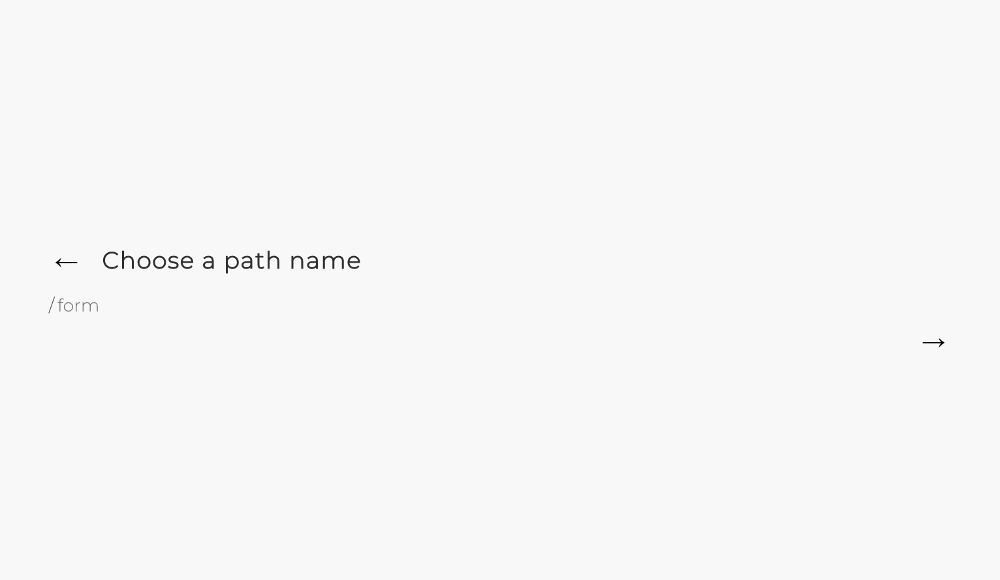
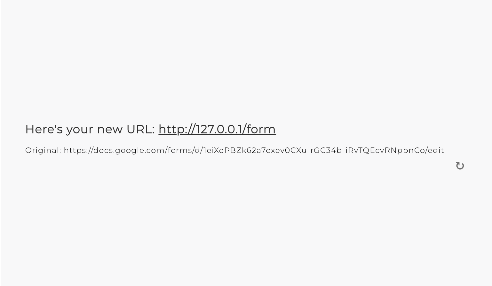

# Stacked-URLs
Convert long urls into short urls. With added backend complexity for a production-ready build.
<p>

</p>


## Features

- Choose a custom path name for the short url, i.e. 127.0.0.1/mypathname

- Measure the amount of times a short url was used
<p align="center">
   
   
   
</p>


## How it works
- The original url and the short url with custom path is stored as a row in the database.
- When the short url is entered into the browser, the backend api will lookup the corresponding original url and perform a redirect.
- The backend api will also increment the click count for a short url whenever it is used.

This app uses 6 services:

1. Frontend - Javascript with React (create-react-app) for front-end UI.
2. Backend - Python with Django for back-end API.
3. Database - PostgreSQL to store the url pairs and click count.
4. Cache - Memcached to cache url pairs for faster redirects.
5. Message Queue - RabbitMQ to asynchronously increment click count in database.
6. Reverse Proxy - Nginx to serve the application.

## How to run
The app is packaged into a docker compose container for easy startup and deployment.

### Local development
1. [Install docker compose](https://docs.docker.com/compose/install/)
2. Clone this repository
   ```bash
   git clone https://github.com/colin-ho/URL-Shortener.git
   ```
3. Run `docker-compose -f docker-compose-dev.yml up`
4. Open the app at http://localhost:3000/

### AWS deployment
This web app has been configured for easy AWS ECS deployment using AWS Fargate. This step requires an AWS account and IAM permissions. [More info here](https://docs.docker.com/cloud/ecs-integration/)
1. Create a docker compose ecs context
   ```bash
   docker context create ecs myecscontext
   docker context use myecscontext
   ```
2. Run `docker compose -f docker-compose-prod.yml up`
3. Check the application url with `docker-compose -f docker-compose-prod.yml ps`
